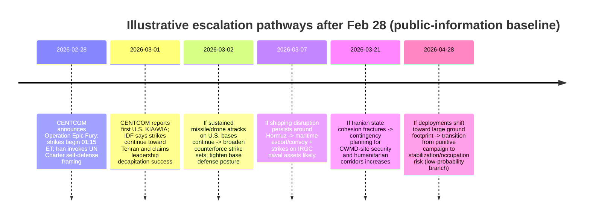

# U.S.–Israeli Strikes on Iran and the Assassination Reporting on Khamenei: Scenario Spectrum for U.S. Responses

## Executive Summary

On February 28, 2026, entity["organization","U.S. Central Command","us combatant command"] announced the start of “Operation Epic Fury,” stating that U.S. and partner strikes began at **1:15 a.m. ET** and targeted categories including **IRGC command-and-control**, **Iranian air defenses**, **missile and drone launch sites**, and **military airfields**. citeturn6view0 On March 1 (as of **9:30 a.m. ET**), CENTCOM reported **three U.S. service members killed in action and five seriously wounded**, noting major combat operations were continuing. citeturn9view0

Israeli public messaging has framed its campaign (Israel’s “Operation Roaring Lion”) as a long-term effort to remove what it calls “existential threats,” asserting rapid early success against Iranian C2, air defenses, and missile forces, and stating that it “eliminated” Iran’s Supreme Leader **Khamenei** in a “precise strike.” citeturn27view0 Iranian official messaging has framed the strikes as **armed aggression** and invoked **UN Charter Articles 2(4) and 51**, asserting a right of self-defense and calling for urgent UN Security Council action. citeturn24view0turn25view0

The “reported assassination” question is no longer merely speculative: Iranian official communications (including Foreign Ministry statements and condolence messaging) and international reporting indicate Iran has **publicly acknowledged Khamenei’s death** and instituted national mourning measures. citeturn25view1turn16search8 However, public accounts of **how** he was located and struck, and of **who else** was killed and where, remain partly contested and subject to wartime information operations. citeturn26news33turn15view0

This report frames the next phase as a spectrum of U.S. responses—ranging from **limited engagement** (air/sea campaign + sanctions + no ground troops) to **prolonged entanglement** (regional war dynamics and, at the extreme, a ground invasion/occupation or stabilization mission). The key analytic judgment is that **U.S. escalation risk is currently driven less by stated war aims than by retaliation dynamics**: persistent Iranian missile/drone attacks on U.S. bases, threats to maritime energy routes, and proxy activation can pull the United States into broader regional operations even if Washington intends to avoid “boots on the ground.” citeturn6view0turn25view0turn36news38turn15view0

**Probabilistic outlook (illustrative; next ~60–90 days):**
- **Limited engagement (no ground combat units; coercive air/sea + sanctions): ~30–40%**—favored by U.S. domestic constraints and the logistical/political difficulty of a ground war, but challenged by ongoing “major combat operations” language and continuing strikes. citeturn9view0turn35news24turn13search10  
- **Sustained air campaign (multi-week to multi-month): ~35–50%**—supported by stated intent to continue striking and by operational logic of suppressing Iranian missile forces and air defenses under continued retaliation. citeturn9view0turn13search10turn27view0  
- **Regional war dynamics (multi-front escalation with proxies; expanded strikes across theaters): ~15–25%**—depends on intensity of Iran’s retaliation and proxy choices; early indicators include attacks on bases, shipping disruption, and proxy declarations. citeturn25view0turn36news38turn15view0  
- **Ground invasion/occupation (or large stabilization footprint): ~2–8%**—low because it requires a qualitatively different political authorization and force package, but non-zero if regime collapse or CWMD-site security imperatives emerge. citeturn15view0turn35news24turn36search22  

Probabilities are not “forecasts”; they are **structured judgments** based on observable constraints, doctrinal/operational requirements, and the current public record. citeturn15view0turn35news24turn36news38

## Timeline of Events and Current Fact Pattern

### What can be stated with high confidence from official releases

**Feb 28, 2026 (early hours, ET):** CENTCOM publicly announced the start of Operation Epic Fury, stating strikes began at **1:15 a.m. ET** and describing target sets (IRGC C2, air defenses, missile/drone sites, airfields). It also stated strikes employed munitions “from air, land, and sea,” and that a CENTCOM task force used **low-cost one-way attack drones** “for the first time in combat.” citeturn6view0

**Mar 1, 2026 (morning, ET):** CENTCOM reported **3 KIA / 5 seriously wounded** as of **9:30 a.m. ET**, with major combat operations ongoing and limited detail pending next-of-kin notifications. citeturn9view0

**Feb 28–Mar 1, 2026 (Israeli official messaging):** The entity["organization","Israel Defense Forces","israel military"] stated it is on the “second day” of “Operation Roaring Lion,” claims it degraded Iranian C2, air defenses, and missile arrays, and asserted it killed “40 commanders and senior officials…in one minute” during the opening strike. It further stated it “eliminated” Khamenei and other senior commanders, while warning additional arenas (including Hezbollah) are being monitored. citeturn27view0

**Iranian official diplomatic framing:** The entity["organization","Ministry of Foreign Affairs of the Islamic Republic of Iran","tehran iran foreign ministry"] issued an official statement describing the strikes as violating sovereignty and territorial integrity, characterizing them as aggression under **UN Charter Article 2(4)**, and asserting Iran’s right of response under **Article 51** while urging UN Security Council action. citeturn24view0 A subsequent official letter attributed to Foreign Minister entity["politician","Seyed Abbas Araghchi","iran foreign minister"] asserted that bases/assets of hostile forces in the region are considered legitimate military targets (as framed by Iran) in the context of self-defense. citeturn25view0

### The assassination reporting on Khamenei

The status of the “reported assassination” moved quickly from *Israeli claims* to *Iranian public acknowledgment* in internationally reported official channels. Israeli leadership messaging initially referenced “signs” of his death. citeturn26news27 International reporting subsequently described Iranian state media confirmation. citeturn16search8 Iranian Foreign Ministry condolence messaging explicitly refers to the “martyrdom” of the Supreme Leader and frames it as a national and religious loss. citeturn25view1

### Escalation-path timeline (illustrative)

This timeline is a **decision-ladder sketch**, not a claim that each step will occur; each branch depends on observable triggers described later. citeturn36news38turn35news24turn25view0

## Primary Official Statements and Stated Objectives

### U.S. stated objectives and operational framing

- CENTCOM described the strike objective as dismantling the Iranian regime’s “security apparatus,” prioritizing locations posing an “imminent threat,” and emphasized early defensive success against “hundreds” of Iranian missile/drone attacks (language reflecting high operational tempo). citeturn6view0  
- U.S. public discourse has also emphasized the continuity of pressure tools beyond kinetic force: the White House issued (earlier in February) an Iran-related executive order and fact sheet framing Iran as an “unusual and extraordinary threat” under a national emergency authorities framework—relevant to any “limited engagement” scenario that leans on sanctions and economic coercion. citeturn35search16turn35search11  
- Media-transcribed presidential messaging (via major wire reporting) indicated a declared shift into “major combat operations,” with implied regime-change signaling, though text-access constraints mean the most reliable public record is through contemporaneous reporting and official military releases rather than a full White House posted transcript. citeturn5search19turn13search10  

### Israeli stated objectives and operational framing

- The IDF spokesperson briefing frames the campaign as designed “to strike the Iranian terrorist regime and remove existential threats to the State of Israel over the long term,” emphasizing air superiority expansion, missile launcher hunting, and continued strikes “as long as required.” citeturn27view0  
- Israeli leadership messaging (as reported in major wire coverage) framed the strikes as intended to remove an “existential threat,” and cast the moment as enabling Iranians to seize their destiny. citeturn26news27  

### Iranian stated objectives, legal claims, and red lines

- Iran’s Foreign Ministry statement explicitly argues the strikes occurred “while Iran and the United States were in the midst of a diplomatic process,” and asserts the armed forces will respond “with full authority and determination.” citeturn24view0  
- In its letter to the UN Secretary-General and Security Council president, Iran’s foreign minister’s office framed regional U.S. bases/assets as legitimate targets (under Iran’s asserted self-defense rationale), a key escalation-relevant threshold because it signals permission structure for broad missile/drone targeting across the Gulf. citeturn25view0  
- Iran’s Foreign Ministry spokesperson entity["politician","Esmail Baghaei","iran mfa spokesperson"] amplified claims about alleged strikes on a school in entity["city","Minab","hormozgan province iran"], urging UN Security Council action—an example of Iran shaping legality narratives and civilian-harm claims to build international pressure. citeturn25view2  

## Casualties, Damage, and What Remains Unverified

### U.S. casualties and base impacts

CENTCOM’s March 1 statement is the principal confirmed source for U.S. casualties at this time: **3 killed** and **5 seriously wounded**, with additional minor injuries. citeturn9view0 The Feb 28 press release had earlier claimed no U.S. casualties and minimal installation damage in the operation’s initial hours, indicating either later successful strikes against U.S. positions or evolving reporting after the opening wave. citeturn6view0turn9view0

### Israeli casualties

The IDF spokesperson stated that during the first day, at least one Israeli resident was killed and civilians were injured at impact sites, while emphasizing air defense limits (“not hermetic”). citeturn27view0 Reporting from major outlets indicates additional casualties from Iranian missile strikes in populated areas, but granular totals shift rapidly and are best treated as provisional until consolidated by official Israeli emergency services or the government. citeturn16search8turn26news33

### Iranian casualties and civilian-harm claims

At the time of writing (March 1, 2026, America/New_York), Iranian casualty reporting is the most contested domain. Iran’s Foreign Ministry spokesperson publicly asserted that strikes hit a primary school in Minab, killing and injuring “dozens” of students. citeturn25view2 Israeli officials publicly said they were “not aware” of any U.S./Israeli strike hitting the school, while CENTCOM indicated awareness of civilian-harm reporting and an investigation posture (per contemporaneous reporting). citeturn13search9

Because these claims are central to legitimacy and escalation dynamics, the most rigorous characterization is:
- **Confirmed:** Iran is making formal civilian-harm allegations through official channels and linking them to UN action requests. citeturn25view2turn25view0  
- **Not independently verified in the open record here:** precise death tolls by site, attribution of specific strikes, and whether damage was caused by direct impact vs. secondary explosions or air-defense intercept debris. citeturn13search9turn15view0  

### Physical damage and battle-damage assessment uncertainty

Major international outlets cited satellite imagery showing heavy damage at Khamenei’s compound area in Tehran, but in the absence of a published, declassified after-action battle-damage assessment, the strongest statement is that **credible commercial imagery has been used publicly to support claims of severe damage**. citeturn13search9turn26news33

## Military Capabilities and Force Posture in the Region

### U.S. posture, basing, and what “limited engagement” can realistically look like

The U.S. operational constraint is not a lack of access; it is the **vulnerability and political sensitivity** of an extensive regional footprint.

A Reuters-compiled basing overview highlights key nodes frequently central to strike, ISR, and C2:
- entity["state","Bahrain","host to us fifth fleet"] hosts U.S. Navy Fifth Fleet headquarters. citeturn36search2  
- entity["city","Doha","qatar capital"]’s region hosts entity["point_of_interest","Al Udeid Air Base","qatar"], described as a forward HQ for CENTCOM and housing around **10,000 troops** (as reported). citeturn36search2  
- entity["country","Kuwait","us staging hub"] hosts multiple installations including Camp Arifjan and others used as staging/logistics locations in prior regional contingencies. citeturn36search2  
- entity["country","United Arab Emirates","us air hub"] hosts Al Dhafra Air Base (a key U.S. Air Force hub), and entity["point_of_interest","Jebel Ali Port","dubai uae"] functions as a major U.S. Navy port-of-call, important for sustainment and carrier logistics. citeturn36search2  

In practical terms, a “limited engagement” posture for the United States is most plausibly:
- **Strike & defend**: sustained counterforce strikes (missiles/drones/air defenses) combined with layered defense of bases and shipping. citeturn6view0turn36news38  
- **Avoid seizure/hold missions**: no major U.S. ground maneuver inside Iran; instead, reliance on air and maritime power, plus cyber/economic tools. citeturn35news24turn35search16  

External mapping and analytical summaries underscore that the U.S. maintains an extensive Middle East presence designed for rapid response, which increases both flexibility and exposure once retaliation begins. citeturn36search22turn36search2

image_group{"layout":"carousel","aspect_ratio":"16:9","query":["US military bases Persian Gulf map","Strait of Hormuz map shipping lanes","Tehran Pasteur district map","Arabian Sea aircraft carrier operations map"],"num_per_query":1}

### Iranian conventional capabilities and proxy options

Unclassified U.S. intelligence assessments describe Iran’s deterrence and warfighting approach as a combination of:
- **Ballistic missile forces** (including large inventories, varied ranges, and survivability tactics), citeturn36search1turn36search21  
- **Naval forces** optimized for threatening maritime traffic in narrow waters (a core risk to the Strait of Hormuz), citeturn36search1turn36news38  
- **Partners and proxies** as a power-projection method, which can extend conflict into multiple theaters and create political deniability. citeturn36search1turn15view0  

In its expert reaction, the entity["organization","Atlantic Council","think tank washington dc"] flagged uncertainty over proxy participation as a decisive variable—specifically referencing the risk of Iraqi militia attacks on U.S. forces and the possibility of renewed Houthi targeting of shipping lanes, while noting ambiguity about Hezbollah’s decision calculus. citeturn15view0 A Defense Intelligence Agency product on Iran’s enabling of Houthi attacks provides an example of how Tehran can facilitate distributed pressure on maritime routes and regional partners. citeturn36search17

### Strait of Hormuz as an escalation multiplier

The chokepoint’s macroeconomic significance is unusually high. EIA reporting indicates that in 2024, flows through the entity["point_of_interest","Strait of Hormuz","persian gulf"] averaged ~**20 million barrels per day**, about **20% of global petroleum liquids consumption**. citeturn36search3turn36search23

Early conflict reporting indicates shipping disruption even without a formally declared closure: Reuters described large numbers of tankers anchoring and noted that the U.S. Navy–led Joint Maritime Information Center said no “official international closure” had been confirmed, while commercial actors paused transits due to risk. citeturn36news38 Oil-market reporting (including Reuters) indicated a sharp price reaction and highlighted analyst expectations of further spikes if disruption persists or expands. citeturn36news40

## Scenario Spectrum for U.S. Responses

### Scenario comparison table

The scenarios below are designed to be **mutually intelligible** rather than perfectly mutually exclusive; real-world trajectories can blend features (for example, a sustained air campaign can coexist with a regionalized proxy war). citeturn15view0turn36news38

| Scenario | Likely triggers / decision points | Required forces & enabling (illustrative, unclassified) | Political and legal costs | Timeline to implement | Likelihood (next ~60–90 days) |
|---|---|---|---|---|---|
| **Limited engagement** (air/sea strikes + sanctions; no U.S. ground combat in Iran) | Iran retaliates but below U.S. “strategic shock” thresholds (no mass U.S. casualties; Hormuz disruption manageable); U.S. prioritizes de-escalation channels | Carrier and land-based airpower + ISR; cruise missiles; base defense; maritime escorts; expanded sanctions tools; diplomacy with regional hosts for basing access citeturn6view0turn36search2turn35search16 | War-powers pressure and public skepticism constrain duration; civilian-harm allegations raise legitimacy costs; alliance management with Israel and Gulf hosts becomes central citeturn35news24turn25view2turn15view0 | Days to weeks (already underway); aim to taper within ~2–6 weeks | **~30–40%** citeturn35news24turn9view0 |
| **Sustained air campaign** (multi-week/month counterforce + regime pressure) | Continued missile/drone pressure on bases; leadership decapitation creates perceived opportunity/necessity for deeper degradation; inability to secure off-ramps quickly | Expanded strike packages; persistent SEAD/DEAD; increased tanker/ISR capacity; widened target sets (missile production, IRGC nodes, air defenses); heightened base hardening citeturn27view0turn6view0turn36search2 | Intensified War Powers confrontation; higher civilian-harm scrutiny; greater risk of alliance fractures and regional host-nation constraints on airspace/basing citeturn35news23turn15view0 | Weeks to months; becomes self-sustaining if retaliation continues | **~35–50%** citeturn13search10turn9view0 |
| **Regional war** (multi-front escalation incl. proxies, shipping, and broader basing attacks) | Proxy activation (especially in entity["country","Iraq","middle east"] / entity["country","Syria","middle east"]), intensified attacks on shipping, sustained barrages on Israel and Gulf states; miscalculation around red lines | Defense of many bases simultaneously; expanded maritime security operations; strikes beyond Iran’s borders against proxy infrastructure; rapid reinforcement of regional air defense; contingency evacuations citeturn25view0turn36news38turn15view0 | Broader coalition diplomacy; risks to civilian aviation and commerce; high domestic political costs if U.S. casualties rise; sharp economic spillovers via energy/logistics citeturn36news38turn35news24turn36news40 | Days to weeks to expand; could persist for months | **~15–25%** citeturn15view0turn36news38 |
| **Ground invasion/occupation or large stabilization mission** (boots on the ground in Iran) | Regime collapse/fragmentation; urgent need to secure high-risk military/nuclear sites; catastrophic attacks on U.S. forces/partners create political momentum for decisive end-state | Very large joint force + sustainment and basing permissions; major logistics (sealift/airlift) and medical/force protection; long-duration stabilization requirements; high risk of insurgency dynamics citeturn36search2turn36search22turn15view0 | Would demand explicit political mandate in practice; extreme war-powers conflict otherwise; high casualty and legitimacy risk; historical “occupation” pitfalls loom large citeturn35news24turn36search12turn15view0 | Months to assemble; years to sustain if occupation-like | **~2–8%** citeturn35news24turn15view0 |

### Why the spectrum is constrained (and what would break the constraints)

**Domestic politics and Congress:** Reporting and official statements show an immediate war-powers backlash, with lawmakers calling the strikes unauthorized and seeking votes to constrain future hostilities. citeturn35news24turn35search17turn35search8 This matters operationally because even if the executive maintains legal arguments for short-term action, sustaining a long campaign without broader authorization carries rising political risk, especially if casualties mount. citeturn9view0turn35news23

**War Powers legal architecture:** The War Powers Resolution (1973) establishes reporting/termination concepts widely invoked in this debate; DOJ’s overview describes the general expectation of terminating use of armed forces absent congressional action within statutory timeframes and conditions. citeturn36search12turn36search33 (The operational relevance is that even “limited engagement” can become politically unsustainable if it drifts past these thresholds without a clear rationale and authorization path.) citeturn35news24turn35news25

**Public opinion and tolerance for casualties/economic shock:** Atlantic Council analysis noted that polling “consistently shows” U.S. public opposition to war with Iran and highlighted that higher U.S. casualties or energy-price spikes could reduce presidential tolerance for a prolonged campaign. citeturn15view0turn36news40

**Basing politics and coalition elasticity:** Iran’s letter framing regional bases as legitimate targets underscores that host nations face direct risk. citeturn25view0turn36search2 Prolonged regional war dynamics therefore depend not only on U.S. intent but on whether partners restrict airspace or basing access under domestic pressure—an issue explicitly flagged by Atlantic Council experts. citeturn15view0

### Historical analogues and why they still shape the policy space

The post-1973 U.S. pattern is that limited deployments and “bounded” operations can become politically unstable when casualties occur or missions lack clarity—exactly the dynamic emerging now, as CENTCOM reports U.S. KIA/WIA and lawmakers demand votes and briefings. citeturn9view0turn35news24turn35news23

In addition, the War Powers framework itself exists because of prior escalation experiences; the legal structure and its recurrent invocation are part of the historical lesson set that constrains 2026 decision-making under uncertainty. citeturn36search12turn36search33

## Indicators That Would Shift Probabilities and Conclusion

### Key indicators to watch (observable, unclassified)

**Indicators increasing the probability of “sustained air campaign” or “regional war”:**
- Official statements emphasizing strikes continuing “as long as required” and “major combat operations” persisting, paired with expanding target categories. citeturn9view0turn27view0turn13search10  
- Rising tempo and geographic spread of Iranian missile/drone attacks against U.S. bases (as framed by Iran’s own diplomatic letter and reported retaliation patterns). citeturn25view0turn5search19  
- Maritime disruption persisting (large tanker anchoring patterns; insurers and shippers pausing transits) even without a formal closure declaration. citeturn36news38turn36news40  

**Indicators decreasing escalation risk (supporting “limited engagement”):**
- Clear, credible U.S.-backed off-ramps (ceasefire pauses, negotiated deconfliction) coupled with reduced Iranian salvo frequency and reduced threats to regional basing nodes. citeturn36news38turn15view0  
- Congressional action that decisively constrains further hostilities—or a political bargain that authorizes a narrow mission scope with clear limits. citeturn35search17turn35news24  

**Indicators raising the probability of a ground footprint (low-probability but high-impact):**
- Evidence of rapid regime fragmentation and loss of centralized control (creating unsecured strategic sites), pushing external actors toward stabilization logic. citeturn26news33turn15view0  
- U.S. posture shifts from “strike/defend” to large-scale ground force enablement—visible through major movement into regional staging hubs and overt preparation for extended sustainment. (This would be difficult to hide given the known basing and logistics chokepoints.) citeturn36search2turn36search22  

### Conclusion

The current episode differs from many recent U.S.–Iran strike cycles because it combines (a) officially acknowledged “major combat operations,” (b) high-end decapitation claims including Khamenei’s death acknowledged through Iranian official messaging, and (c) retaliation dynamics that directly pressure U.S. regional basing and global energy transit routes. citeturn9view0turn25view1turn27view0turn36news38turn36search3

The most analytically defensible near-term expectation is **continued air/sea–centric operations**—either as a relatively bounded campaign or as a sustained air campaign—because that is consistent with current official statements, available force posture, and U.S. political constraints against a ground war. citeturn6view0turn9view0turn35news24turn36search2 The principal pathway to a worse outcome is not a deliberate U.S. decision to invade, but a **retaliation-driven widening**: attacks on bases, shipping disruption, and proxy activation can push the United States into broader regional combat operations even if Washington avoids a formal ground invasion. citeturn25view0turn36news38turn15view0